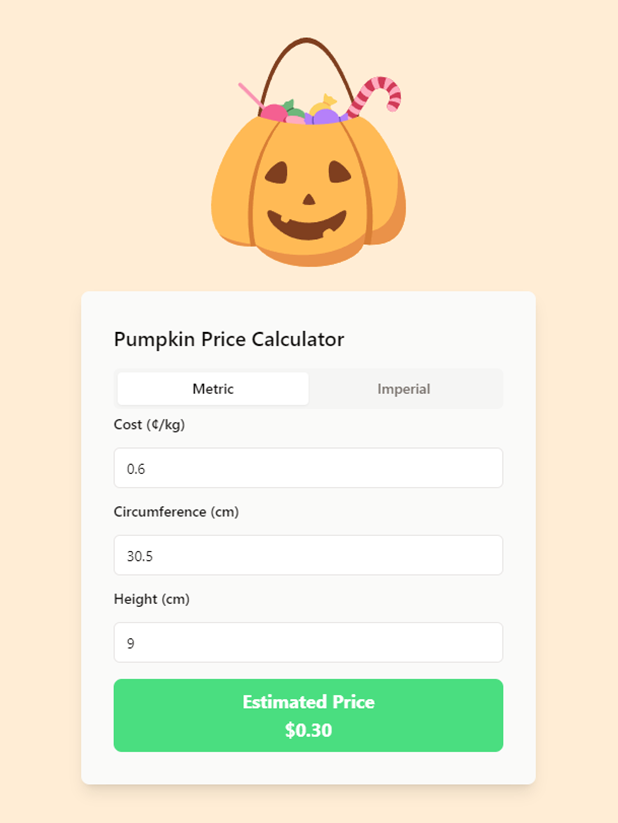

# Pumpkin Pricer

Uses a linear regression model to estimate pumpkin weight based on circumference and height. The model is based on an interaction term between these two factors. A price is then estimated from the weight.

